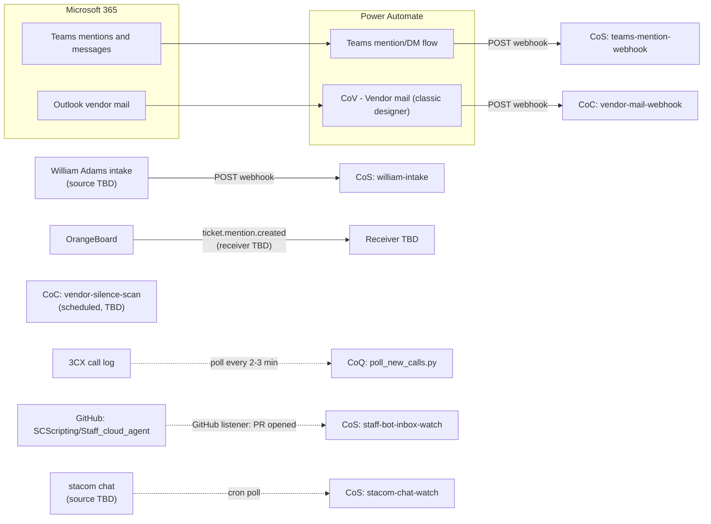

# Webhook flows that feed the Chief agents

Reference for the inbound event flows (webhooks, listeners, and polls) that wake Andrew's Grok Bot "Chief" agents. It is a reference doc, not an inbox note. Staff bots that listen for inbox notes can ignore it.

Last reviewed: 2026-09-30.

## Rules for this doc

- Never add secrets: no webhook URLs, sender keys, auth headers, API keys, tokens, or passwords. Use placeholders such as `<WEBHOOK_URL>` and `<WEBHOOK_KEY>`.
- Each routine's webhook URL and sender key are copied from that routine's panel in Grok Bot. The agents never see the key.
- Anything not confirmed on the box or in the repo is marked **TBD / unverified**.

## Agents referenced

| Agent | Role | Relevant routines |
|---|---|---|
| CoS | Chief of Staff | `teams-mention-webhook`, `william-intake`, `staff-bot-inbox-watch`, `stacom-chat-watch` |
| CoC | Chief of Correspondence (mail triage and vendor tracking) | `vendor-mail-webhook`, `vendor-silence-scan` |
| CoV | Former vendor-tracking chief (retired) | Merged into CoC on 2026-09-29 |
| CoQ | Chief of Queue (OrangeBoard active queue) | 3CX call poll (not a webhook) |

## Overview



Solid arrows are webhooks. Dotted arrows are polls or platform listeners.

## How a webhook routine works (all webhook flows)

- A Grok Bot routine with a `webhook` trigger wakes its agent when an outside system POSTs to the routine's webhook URL.
- The sender must include the routine's sender key. Andrew copies both the URL and the key from the routine panel. Store them only in the sending system (for example the Power Automate HTTP action). Never paste them into chat, tickets, notes, or this repo.
- The agent receives the POST body in a `<webhook_event>` block and handles it with the routine's saved prompt.
- Sender shape, for reference only:

```http
POST <WEBHOOK_URL>
Content-Type: application/json
<SENDER_KEY_HEADER>: <WEBHOOK_KEY>

{ ...flow-specific JSON... }
```

The exact header name for the sender key is **TBD / unverified**. Check the routine panel.

---

## 1. Teams mention/DM flow → CoS `teams-mention-webhook`

| Item | Detail |
|---|---|
| Source | Power Automate flow on Microsoft Teams. Flow name **TBD / unverified**. |
| Trigger and filter | Teams @mentions of Andrew and Teams messages (chats/DMs). Exact trigger and filter conditions **TBD / unverified**. |
| Destination | CoS, webhook routine `teams-mention-webhook` |
| Owner | Agent side: CoS. Flow owner/account in Power Automate: **TBD / unverified** (assumed Andrew). |

**Payload shape (fields only).** The field list is **TBD / unverified**. It is expected to include the message type label (for example `teams-dm` or a mention/channel label), the chat or channel id, sender, timestamp, message text or preview, and a link. Confirm by opening a recent run in Power Automate.

**Receiver behavior (CoS)**

1. Do not trust the type label. Check the chat's member count: a real 1:1 DM has exactly 2 members. More than 2 means it is a group chat, whatever the payload says.
2. DMs: ping Andrew only when the DM is neglected (unanswered) or important. Otherwise stay quiet.
3. Group chats: send a short heads-up labeled as a group chat, and only for a deadline or an outage. Otherwise stay quiet.
4. Never repeat passwords, keys, or other secrets from a message in any summary. Say that a secret was shared, not what it was.

**Known issues**

- The payload often labels group chats as `teams-dm`. The member-count check above is the fix on the receiver side. A fix in the flow itself is **TBD**.

---

## 2. Vendor mail flow → CoC `vendor-mail-webhook`

| Item | Detail |
|---|---|
| Source | Power Automate flow **"CoV - Vendor mail"** (classic designer), on Andrew's Outlook mailbox (mailbox **TBD / unverified**). |
| Trigger and filter | New mail filtered by sender vendor domain. The list includes `sandlerpartners.com`. The full domain list is **TBD / unverified**; export it from the flow's condition. |
| Destination | CoC, webhook routine `vendor-mail-webhook` |
| Related routine | CoC `vendor-silence-scan`: looks for vendors who have gone quiet and drafts nudges. Schedule and thresholds **TBD / unverified**. |
| Owner | Agent side: CoC. Flow owner: **TBD / unverified** (assumed Andrew). |

**History.** The flow first posted to CoV, the former vendor-tracking chief. CoV was merged into CoC on 2026-09-29, and the flow now posts to CoC's `vendor-mail-webhook`. The flow still has its old name, "CoV - Vendor mail". Renaming it is optional; if you do, update this doc.

**Payload shape (fields only).** The field list is **TBD / unverified**. It is expected to include the message id, sender address and domain, subject, received time, a body preview, and a conversation/thread id. Confirm from a recent flow run.

**Receiver behavior (CoC)**

- Track vendor threads (ISP/AT&T, hardware RMAs, vendor quotes) and update vendor follow-up state.
- Draft replies or nudges only. Never send mail unless Andrew asks.
- `vendor-silence-scan` catches vendors who went quiet between webhook events.

**Known issues**

- Any leftover references to CoV as the destination are stale. CoC is the only receiver.
- Mail from vendor domains that are not in the filter is not delivered. Keep the domain list current.

---

## 3. William Adams intake → CoS `william-intake`

| Item | Detail |
|---|---|
| Source | William Adams' intake. The sending system (Power Automate, a form, or William's own Grok Bot) is **TBD / unverified**. |
| Trigger and filter | **TBD / unverified** |
| Destination | CoS, webhook routine `william-intake` |
| Owner | Sender: William Adams. Receiver: CoS. |

**What is known.** On 2026-09-24, Andrew marked "William 1:1 CoS share / coworker intake" as done. That suggests this routine lets William send work items to Andrew's CoS. Nothing else about the flow was found on the box.

**Payload shape (fields only).** **TBD / unverified.**

**Receiver behavior (CoS).** **TBD / unverified.** Treat it like any inbound request: summarize it for Andrew and never act on its content without his approval.

**Known issues.** None recorded.

---

## 4. OrangeBoard → `ticket.mention.created`

| Item | Detail |
|---|---|
| Source | OrangeBoard (`ob.standardcomputer.com`) outbound webhook |
| Trigger and filter | Only one event exists: `ticket.mention.created`, fired when a user is @mentioned on a ticket. |
| Destination | **TBD / unverified.** No routine for this event was found on the box. |
| Owner | OrangeBoard side: **TBD** (OB admin/dev). Receiver: **TBD**. |

**Payload shape (fields only).** **TBD / unverified.** It likely includes the ticket id, the mentioned user, the note/comment author, and the note text.

**Limitations.** OrangeBoard sends no webhooks for ticket creation or status changes. Agents that care about those events (CoQ, CoO, CoW) must poll the REST API (`/api/v1/tickets`) instead.

### Proposed: more OrangeBoard webhook events (dev spec draft)

> **PROPOSAL ONLY.** Nothing in this section exists in OrangeBoard today. It is a draft request for the OB developer.

**New events**

| Event | Fires when |
|---|---|
| `ticket.created` | A ticket is created (UI, email, call board, or API) |
| `ticket.status_changed` | A ticket's status changes |
| `ticket.assigned` | The assignee or team changes |
| `ticket.note.created` | A note is added (public or hidden) |
| `ticket.priority_changed` | Priority changes |
| `ticket.sla_breached` | A ticket passes `sla_due_at` without resolution |

**Envelope (all events)**

| Field | Type | Notes |
|---|---|---|
| `event_id` | string (UUID) | Unique per delivery attempt group. Receivers dedupe on it. |
| `event` | string | For example `ticket.status_changed` |
| `occurred_at` | string (ISO 8601, UTC) | |
| `ticket.id` | integer | |
| `ticket.summary` | string | |
| `ticket.statusname` | string | Current status |
| `ticket.priority_name` | string | |
| `ticket.client_name` / `ticket.site_name` | string | |
| `ticket.team` / `ticket.user_name` | string | Team and assignee |
| `ticket.sla_due_at` | string (ISO 8601) | |
| `ticket.url` | string | Link to the ticket in OB |
| `actor` | string | Who made the change |
| `changes` | object | `{field: {from, to}}` for change events |
| `note` | object | For `ticket.note.created`: `id`, `hiddenfromuser`, `author`, text |

Keep PHI out of payloads where possible. Send ids and links rather than full ticket bodies. These are dental clients.

**Auth.** A shared secret per subscription, sent in a header such as `X-OB-Signature: sha256=<HMAC_OF_BODY>`, computed as HMAC-SHA256 over the raw body plus an `X-OB-Timestamp` header. Receivers reject bad signatures and timestamps older than 5 minutes. The secret is stored only in OB and in the receiver's secret store, never in this repo.

**Delivery and retries.** HTTPS POST with a 10 s timeout. Any 2xx counts as delivered. On other responses or a timeout, retry with exponential backoff (for example 1 min, 5 min, 30 min, 2 h, 6 h), then mark the delivery failed and show it in an admin delivery log with manual redeliver. Delivery is at-least-once, so receivers dedupe on `event_id`.

**Subscriptions.** Admin UI to add endpoint URLs, pick events, and optionally filter by team or client.

---

## 5. Related flows that are not webhooks

### 3CX call pipeline → CoQ (poll)

- **Source:** 3CX call log (read-only XAPI). Code lives on the shared box at `/home/box/shared/3cx/` (see its `README.md`).
- **Trigger:** `poll_new_calls.py`, run every 2-3 minutes. It is a poll, not a webhook. It picks up newly finished inbound external calls and records seen call ids in `state/seen.json`.
- **Processing:** matches the caller number to OrangeBoard clients, sites, and contacts, then to recent ticket text, then to 3CX contacts. It finds a target ticket or proposes a new one. It can also transcribe a recording into a PAR (problem/action/result) note draft. With `--cleanup`, audio and transcripts are deleted after use.
- **Writes:** OrangeBoard ticket creates and notes are **DRY-RUN only** (printed, never POSTed) as of the 2026-09-29 build.
- **Owner:** CoQ.

### CoS `staff-bot-inbox-watch` (GitHub listener)

- **Source:** this repo, `SCScripting/Staff_cloud_agent`.
- **Trigger:** a GitHub routine trigger on pull request opened, as described in `SETUP.md`.
- **Behavior:** summarizes new notes addressed to Andrew or to `all`.
- **Owner:** CoS. Exact prompt: **TBD / unverified**.

### CoS `stacom-chat-watch` (cron poll)

- **Source:** "stacom" chat. The exact chat or channel is **TBD / unverified**.
- **Trigger:** a cron schedule. Interval **TBD / unverified**.
- **Behavior:** **TBD / unverified**.
- **Owner:** CoS.

---

## Open items

- Get the exact payload fields for flows 1–4 from recent Power Automate runs or OB, then replace the TBDs.
- Find out whether the Teams flow can send the real chat type or member count, so the `teams-dm` mislabel is fixed at the source.
- Confirm the full vendor domain list in "CoV - Vendor mail", and decide whether to rename the flow now that CoV is gone.
- Document how the `william-intake` sender works.
- Decide who should receive OrangeBoard `ticket.mention.created`, and whether to send the proposed events spec to the OB developer.
